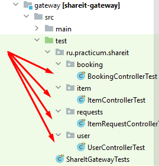
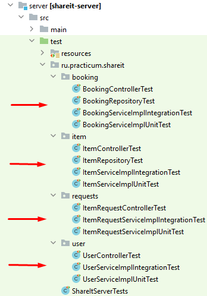
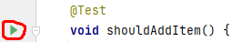
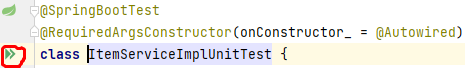
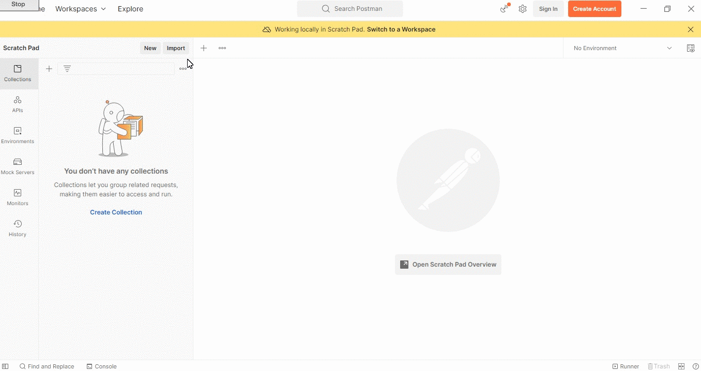

# ShareIt

#### (от англ. share — «делиться», it — «это»)

### Приложение для аренды разных вещей

###### Приложение разработано в рамках прохождения учебного курса [Java-разработчик от Яндекс.Практикум](https://practicum.yandex.ru/java-developer/)

***

## Идея

Шеринг как экономика совместного использования набирает сейчас всё большую полярность. Если в 2014
году глобальный рынок шеринга оценивался всего в $15 млрд, то к 2025 может достигнуть $335 млрд.
 Почему шеринг так популярен? Представьте, что на воскресной ярмарке вы купили несколько картин и
хотите повесить их дома. Но вот незадача — для этого нужна дрель, а её у вас нет. Можно, конечно,
пойти в магазин и купить, но в такой покупке мало смысла — после того, как вы повесите картины,
дрель будет просто пылиться в шкафу. Можно пригласить мастера — но за его услуги придётся заплатить.
И тут вы вспоминаете, что видели дрель у друга. Сама собой напрашивается идея — одолжить её.
 Большая удача, что у вас оказался друг с дрелью и вы сразу вспомнили про него! А не то в поисках
инструмента пришлось бы писать всем друзьям и знакомым. Или вернуться к первым двум вариантам —
покупке дрели или найму мастера. Насколько было бы удобнее, если бы под рукой был сервис, где
пользователи делятся вещами! Это приложение разработано как раз для этого.

## Основа приложения

Приложение состоит из двух сервисов.
Сервис **gateway** — является распределяющим "шлюзом", который проводит валидацию входящих
данных и перенаправляет запрос в сервис **server**.
Основной сервис **server** содержит всё необходимое для работы продукта. Хранение данных
осуществляется в базе данных.

## Функционал

Приложение позволяет выбрать действия для следующих категорий:

1) **пользователь**:

    - добавление нового пользователя (данные о новом пользователе передаются в теле запроса на
      эндпоинт `POST /users`)
    - получение списка всех пользователей (эндпоинт `GET /users`)
    - получение пользователя по идентификатору (идентификатор пользователя передаётся
      в переменную пути `{userId}` на эндпоинт `GET /users/{userId}`)
    - обновление пользователя (идентификатор пользователя передаётся в переменную пути `{userId}`,
      данные о новом пользователе передаются в теле запроса на эндпоинт `PATCH /users/{userId}`)
    - удаление пользователя по идентификатору (идентификатор пользователя передаётся
      в переменную пути `{userId}` на эндпоинт `DELETE /users/{userId}`)

2) **вещь**:

    - добавление новой вещи (идентификатор владельца вещи передаётся в заголовке запроса
      `X-Sharer-User-Id`, данные о новой вещи передаются в теле запроса на эндпоинт `POST /items`)
    - обновление информации о вещи (идентификатор владельца вещи передаётся в заголовке запроса
      `X-Sharer-User-Id`, идентификатор вещи для обновления передаётся в переменную пути `{itemId}`,
      данные для обновления информации о вещи передаются в теле запроса на эндпоинт
      `PATCH /items/{itemId}`)
    - получение информации о вещи по идентификатору (идентификатор пользователя передаётся в
      заголовке запроса `X-Sharer-User-Id`, идентификатор вещи передаётся в переменную
      пути `{itemId}`
      на эндпоинт `GET /items/{itemId}`)
    - получение списка всех вещей пользователя (на эндпоинт `GET /items?from=&size=`
      передаются идентификатор владельца вещи в заголовке запроса `X-Sharer-User-Id` и в параметрах
      запроса `?from=&size=` с какой страницы необходимо показать список вещей `from` и сколько
      вещей будет доступно для просмотра на странице `size`. Параметры запроса `?from=&size=` можно
      не указывать, в этом случае будут отображены первые 10 вещей из всего списка)
    - поиск вещи по названию или описанию (на эндпоинт `GET /items/search?text=&from=&size=`
      в параметрах запроса передаются текст для поиска `text`, с какой страницы необходимо показать
      список результатов поиска вещей `from` и сколько вещей будет доступно для просмотра на
      странице `size`. Параметры запроса `?from=&size=` можно не указывать, в этом случае будут
      отображены первые 10 вещей из всего списка)
    - добавление комментария к вещи (на эндпоинт `POST /items/{itemId}/comment` передаются
      идентификатор пользователя в заголовке запроса `X-Sharer-User-Id`, идентификатор вещи в
      переменной
      пути `{itemId}` и данные о новом комментарии в теле запроса)

3) **бронирование вещи (если вещь есть в базе данных)**:

    - добавление нового бронирования (на эндпоинт `POST /bookings` в заголовке
      запроса `X-Sharer-User-Id` передаётся идентификатор пользователя, который хочет забронировать
      вещь, в теле запроса передаётся информация о новом бронировании)
    - подтверждение бронирования владельцем вещи (на эндпоинт `PATCH /bookings/{bookingId}` в
      заголовке `X-Sharer-User-Id` передаётся идентификатор владельца вещи, в переменную пути
      `{bookingId}` передаётся идентификатор бронирования)
    - получение бронирования по идентификатору (на эндпоинт `GET /bookings/{bookingId}` в
      заголовке `X-Sharer-User-Id` передаётся идентификатор владельца вещи или пользователя,
      забронировавшего вещь, в переменную пути `{bookingId}` передаётся идентификатор бронирования)
    - получение всех бронирований пользователя (на эндпоинт `GET /bookings?state=&from=&size=` в
      заголовке запроса `X-Sharer-User-Id` передаётся идентификатор пользователя, бронирования
      которого требуется получить, в параметр запроса `state=` передаётся статус бронирования (
      доступны варианты _ALL_ - все, _CURRENT_ - текущие, _PAST_ - прошедшие, _FUTURE_ - будущие),
      в параметр запроса `from=` передаётся номер страницы, с которой необходимо показать список
      бронирований, в параметр запроса `size=` - сколько вещей будет доступно для просмотра на
      странице. Параметры запроса `?state=&from=&size=` можно не указывать, в этом случае будут
      отображены первые 10 бронирований из всего списка)
    - получение всех бронирований владельца вещей (на эндпоинт
      `GET /bookings/owner?state=&from=&size=` в заголовке запроса `X-Sharer-User-Id` передаётся
      идентификатор владельца вещей, в параметр запроса `state=` передаётся статус бронирования
      (доступны варианты _ALL_ - все, _CURRENT_ - текущие, _PAST_ - прошедшие, _FUTURE_ - будущие),
      в параметр запроса `from=` передаётся номер страницы, с которой необходимо показать список
      бронирований, в параметр запроса `size=` - сколько вещей будет доступно для просмотра на
      странице. Параметры запроса `?state=&from=&size=` можно не указывать, в этом случае будут
      отображены первые 10 бронирований из всего списка)

4) **запрос на аренду вещи (если вещи нет в базе данных)**:

    - добавление нового запроса на аренду (на эндпоинт `POST /requests` в заголовке
      запроса `X-Sharer-User-Id` передаётся идентификатор пользователя, который создаёт запрос, в
      теле запроса передаётся информация о новом запросе на аренду)
    - получение всех запросов пользователя (на эндпоинт `GET /requests` в заголовке запроса
      `X-Sharer-User-Id` передаётся идентификатор пользователя, который создал запросы)
    - получение всех имеющихся запросов на аренду (на эндпоинт `GET /requests/all?from=&size=`
      в заголовке запроса `X-Sharer-User-Id` передаётся идентификатор пользователя, в параметр
      запроса `from=` передаётся номер страницы, с которой необходимо показать список запросов
      на аренду, в параметр запроса `size=` - сколько запросов будет доступно для просмотра на
      странице. Параметры запроса `?from=&size=` можно не указывать, в этом случае будут
      отображены первые 10 запросов из всего списка)
    - получение запроса на аренду по идентификатору (на эндпоинт `GET /requests/{requestId}` в
      заголовке запроса `X-Sharer-User-Id` передаётся идентификатор пользователя, в переменную пути
      `{requestId}` передаётся идентификатор запроса на аренду)

## Стек технологий

 - *[Windows](https://www.microsoft.com/ru-ru/software-download/windows10) 10* - операционная
система
 - *[Java](https://www.java.com/ru/) 11* - язык программирования
 - *[IntelliJ IDEA](https://www.jetbrains.com/ru-ru/idea/download/?ysclid=l8l4s0cdro888284513#section=windows)
2022.1.4 (Ultimate Edition)* - среда разработки
 - *[Spring Boot](https://spring.io/blog/2022/07/21/spring-boot-2-7-2-available-now) 2.7.2* -
используемый фреймворк
 - *[Apache Maven](https://maven.apache.org/) 4.0.0* - управление зависимостями
 - *[Project Lombok](https://projectlombok.org/) 1.18.24* - библиотека аннотаций для сокращения
шаблонного кода
 - *[Hibernate](https://hibernate.org/) 5.6.10* - ORM-фреймворк
 - *[PostgreSQL](https://www.postgresql.org/) 13.7-alpine* - основная база данных
 - *[H2](https://ru.wikipedia.org/wiki/H2)* - база данных для тестирования
 - *[Docker Desktop](https://docs.docker.com/desktop/install/windows-install/) 20.10.17* -
платформа контейнеризации
 - *[Docker Compose](https://docs.docker.com/compose/install/) 3.8* - утилита для
развертывания нескольких контейнеров
 - *[Postman](https://www.postman.com/downloads/) 9.31.0* - приложение для выполнения запросов
к API.
 - *[JUnit](https://junit.org) 5.8.2* - фреймворк для модульного тестирования программного
обеспечения на языке Java.
 - *[Mockito](https://site.mockito.org/) 4.5.1* - фреймворк для тестирования программного 
обеспечения.

## Запуск приложения

На Вашем компьютере должны быть установлены соответствующие приложения из раздела ["Стек
технологий"](#стек-технологий).
Для запуска приложения необходимо:

- склонировать [проект](https://github.com/gorden73/ShareIt) на свой компьютер
- запустить приложение _Docker_
- открыть склонированный проект в _IntelliJ IDEA_
- открыть терминал командной строки и вписать команду `mvn clean package`. Дождаться выполнения
  успешной сборки проекта.
- далее в терминал вписать команду `docker compose up` и дождаться успешного запуска сервисов
  _gateway_ и _server_ в контейнерах _Docker_.

 Для использования приложения необходимо открыть браузер или программу для
работы с API, например, [Postman](https://www.postman.com/).
 В адресной строке написать `https://localhost:8080/` и далее необходимый эндпоинт для
подходящего действия из раздела [Функционал](#функционал).

## Выполнение тестов

Написаны модульные и интеграционные тесты (выполняются в отдельной базе данных
[H2](https://ru.wikipedia.org/wiki/H2)), также есть тестирование с помощью коллекции тестов и
приложения [Postman](https://www.postman.com/), способного выполнять запросы к API.
 Чтобы выполнить модульные тесты достаточно открыть склонированный проект
в *[IntelliJ IDEA](https://www.jetbrains.com/ru-ru/idea/download/?ysclid=l8l4s0cdro888284513#section=windows)*
, перейти в директорию тестов `ShareIt/gateway/src/test/ru.practicum.shareit` и выбрать из
предложенных интересующий класс для проверки (красные стрелки)
 
 или `ShareIt/server/src/test/ru.practicum.shareit` и выбрать из предложенных интересующий
класс для проверки (красные стрелки).
 
 Внутри класса можно запустить выполнение определенного теста, нажав на зелёный треугольник слева
от названия теста
 
 или же запустить все тесты, которые есть в данном классе.
 
 Для запуска коллекции тестов необходимо предварительно
выполнить все инструкции из раздела ["Запуск приложения"](#запуск-приложения), далее запустить
приложение [Postman](https://www.postman.com/downloads/), импортировать
[коллекции тестов](/postman/ShareItTests.json), нажать на вкладку *"Run collection"*.
Готово. Тесты пройдут автоматически.
 

## Автор

Связаться с автором проекта можно в [telegram](https://web.telegram.org/) (@gorden73).

[Вернуться в начало](#shareit)